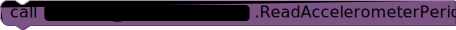
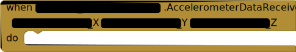

### Microbit_Accelerometer

The Microbit_Accelerometer component lets users configure the Micro:bit's on-board accelerometer and receive one or more accelerometer samples via the appropriate methods.  The accelerometer's report rate, or period, is 

#### Properties

+ `BluetoothDevice` – 

#### Methods

+ `ReadAccelerometerData` – Read a single sample of accelerometer data from the micro:bit. On successful read, the
 <a href="#AccelerometerDataReceived"><code>AccelerometerDataReceived</code></a>
 event will be run.

+ `ReadAccelerometerPeriod` – Method for ReadAccelerometerPeriod

+ `RequestAccelerometerDataUpdates` – Method for RequestAccelerometerDataUpdates

+ `StopAccelerometerDataUpdates` – Method for StopAccelerometerDataUpdates

+ `WriteAccelerometerPeriod` – Use the <code>WriteAccelerometerPeriod</code> method to change how frequently the Micro:bit
 sends accelerometer data to App Inventor. The period is measured in milliseconds. According to
 the micro:bit specification, valid values are 1, 2, 5, 10, 20, 80, 160, and 640 ms.
    + <code>period</code> &mdash; The new accelerometer reporting period, in ms.

#### Events

+ `AccelerometerDataReceived` – The <code>AccelerometerDataReceived</code> event is run whenever accelerometer samples are
 received from the micro:bit. This is usually a result of performing a
 <a href="#ReadAccelerometerData">read</a> or
 <a href="#RequestAccelerometerDataUpdates">request</a> operation.
 The X, Y, and Z values are in thousands of 1 Earth gravity (G=-9.8 m/s2), and so
 should be scaled by 1/1000.
    + <code>Accelerometer_X</code> &mdash; The X value of the accelerometer, in milliG.
    + <code>Accelerometer_Y</code> &mdash; The Y value of the accelerometer, in milliG.
    + <code>Accelerometer_Z</code> &mdash; The Z value of the accelerometer, in milliG.

+ `AccelerometerPeriodReceived` – Event for AccelerometerPeriodReceived

+ `WroteAccelerometerPeriod` – Event for WroteAccelerometerPeriod

